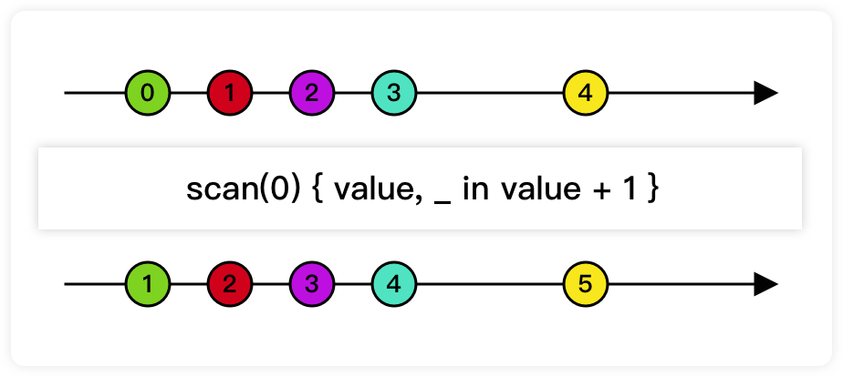

### # Operator

## scan

通过一个闭包变换数据源的元素。这个Publisher保存上一次变换后的结果，并把这个暂存的结果和当前收到的元素作为参数提供给变换闭包。

```swift
extension Publisher {
    ///   - initialResult: 暂存 nextPartialResult 上次计算结果。 
    ///   - nextPartialResult: 闭包: (initialResult, Output) -> nextPartialResult 
    public func scan<T>(_ initialResult: T, // 
                        _ nextPartialResult: @escaping (T, Self.Output) -> T) 
  												-> Publishers.Scan<Self, T>

}
```



- 示例

```swift
let pub = (0...5)
    .publisher
    .scan(0, { return $0 + $1 })
    .sink(receiveValue: { print ("\($0)", terminator: " ") })
   // Prints "0 1 3 6 10 15 ".
```


## tryScan

```swift
extension Publisher {
	通过向闭包提供当前元素以及闭包返回的最后一个值来转换上游发布者的元素
    /// Transforms elements from the upstream publisher by providing the current element to an error-throwing closure along with the last value returned by the closure.
    ///
    /// If the closure throws an error, the publisher fails with the error.
    /// - Parameters:
    ///   - initialResult: The previous result returned by the `nextPartialResult` closure.
    ///   - nextPartialResult: An error-throwing closure that takes as its arguments the previous value returned by the closure and the next element emitted from the upstream publisher.
    /// - Returns: A publisher that transforms elements by applying a closure that receives its previous return value and the next element from the upstream publisher.
    public func tryScan<T>(_ initialResult: T, _ nextPartialResult: @escaping (T, Self.Output) throws -> T) -> Publishers.TryScan<Self, T>
}
```

